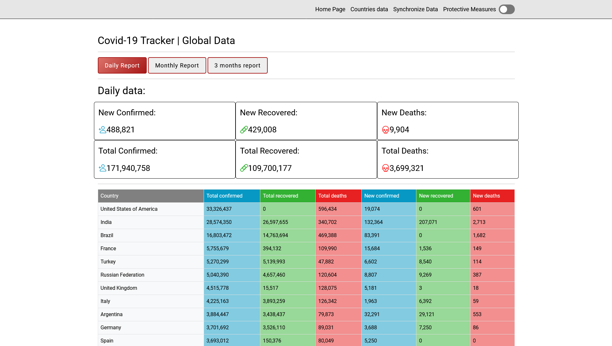

# BrainsterProjects_KristijanStojcevWD1

# Covid-19 Tracker

Covid-19 Tracker is a project for tracking global Covid statistics.

## Description

This project is made for tracking, storing and listing Global Covid-19 data as well as data for each country.
The project features filters that select data accordingly to one of the selected filters("Daily", "Monthly", "Three months").
The landing page is filled with global data, while the countries page is ment for specifying a certain country and getting data specifically for that country.
The protective measures page has information about staying safe and protecting us and others.

## Usage

<h3>Make changes in database/config.php accordingly for your machine</h3>
<h3>PASSCODE for database synchronization: <b>"8rK6jCGW+mE+vsQhoWzNJw=="</b></h3>

The "data_sync.php" file is made for updating the database automatically with Cron, but there is a manual way of updating the database:
on the Navbar there is a "Synchronize Data" button which upon being clicked opens a modal that asks for a passcode in order to proceed
required PASSCODE is "8rK6jCGW+mE+vsQhoWzNJw==", if any other passcode is entered an error message will be displayed and after 5 seconds
you will be redirected to the index page.

## API Reference

It stores up data from 2021-01-01 to 'present'. The data is taken from this API("https://documenter.getpostman.com/view/10808728/SzS8rjbc"),
and then inserted to a custom database. All the data displayed on the pages is pulled from the database.

## Screenshot

